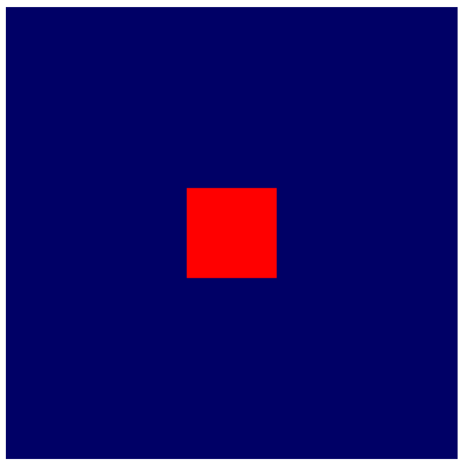

[구글에서 codelab으로 설명한 webGPU](https://codelabs.developers.google.com/your-first-webgpu-app?hl=ko#0)
# WebGPU
1. 웹 앱에서 GPU의 기능에 액세스하기 위한 새로운 최신 API이다
2. WebGL과 차이점?  
    1. 2007년 OpenGL ES 2.0 API와 더 오래된 OpenGL API를 기반으로 만듬(구식 아키텍처)
    2. 크로스 플랫폼 방식으로 GPU 기능을 사용 설정하는 데 초점을 맞추고 사용성 개선(Direct3D 12, Metal, Vulkan이 네이티브)
3. 렌더링 기술을 지원하는 데 필요한 기능을 갖추고 있다
4. 렌더링 외의 컴퓨팅에서도 사용할 수 있다.
5. typescript에서도 완벽하게 작동한다.(@webgpu/types 정의를 import)

# 코드 순서
1. GPUAdapter를 요청해야함. 어댑터는 특정 GPU 하드웨어를 WebGPU가 표현한 것.
`navigator.gpu.requestAdapter()`
2. GPUAdapter로 device를 요청해야함. 
`adapter.requestDevice()`
3. canvas에서 GPUCanvasContext를 요청(2d, webgl 컨텍스트를 사용하여 Canvas2D 또는 WebGL 컨첵스트를 초기화하는 것과 동일)
4. context를 configure하여 기기와 연결
    1. 이 때, format 속성이 가장 중요한데, device 및 컨첵스트에서 사용해야 하는 텍스처 형식을 전달한다.
    2. 텍스처는 WebGPU가 이미지 데이터를 저장하는 데 사용하는 객체이며, 각 텍스처에는 해당 데이터가 메모리에 배치되는 방식을 GPU에게 알리는 형식이 있다.
    3. 기기에 맞는 텍스처 형식을 사용해야 가장 성능이 우수하다.
    4. WebGGPU에서 캔버스에 사용할 형식을 알려준다.
    `navigator.gpu.getPreferredCanvasFormat()`
5. GPU 명령어를 기록하기 위한 GPUCommandEncoder 생성
6. 렌더 패스를 encoder로 시작한다.
    1. 렌더 패스는 WebGPU의 모든 그리기 작업이 발생하는 것을 말한다.
    2. 각 컨트롤은 `beginRenderPass()`로 호출하고, 이 메서드는 실행된 그리기 명령어의 출력을 수신하는 텍스처를 정의한다.  반환값이 pass이다.
    3. context.getCurrentTexture()를 호출하여 컨텍스트에서 텍스처를 가져온다.
7. 렌더 패스를 pass.end()로 종료한다.
8. device.queue.submit([encoder.finish()])로 명령 버퍼를 제출한다.
    1. 이후에 캔버스 콘텐츠를 다시 업데이트하려면 새 명령어 버퍼를 기록하고 제출하여 context.getCurrentTexture()를 다시 호출하여 렌더 패스의 새 텍스처를 가져와야 한다.

# 도형 그리기
## GPU의 그리기 방식 이해하기
1. GPU는 점, 선, 삼각형(WebGPU에서 이를 primitive로 지정함)만 처리한다.
2. 점, 또는 정점은 Cartesian 좌표계의 한 점을 정의하는 X, Y, Z 값으로 정의된다.
    1. 캔버스의 너비 또는 높이에 관계없이 X축의 가장 왼쪽이 -1, 오른쪽이 +1, Y축의 가장 아래쪽이 -1, 위쪽이 +1. (0,0)은 언제나 캔버스의 중심.
3. GPU는 꼭짓점 셰이더를 통해 꼭짓점을 클립 공간으로 변환한다.
    1. 이 셰이더로 꼭짓점에서 광원까지 방향도 계산할 수 있다.
    2. GPU는 픽셀을 결정한다.
4. 프레그먼트 셰이더라는 프로그램으로 각 픽셀의 색상을 계산한다.
    1. 단순한 색상 변환
    2. 복잡한 작업
        1. 반사된 태양광에 상대적인 표면의 각도 계산
        2. 안개를 통한 필터링
        3. 표면의 금속성 정도
5. 삼각형이 정정으로 정의되어야하므로, 사각형도 2개의 삼각형으로 나눠야한다.
    ``` javascript
    const vertices = new Float32Array([ // <- 틀렸음
    //   X,    Y,
    -0.8, -0.8,
    0.8, -0.8,
    0.8,  0.8,
    -0.8,  0.8,
    ]);

    const vertices = new Float32Array([
    //   X,    Y,
    -0.8, -0.8, // Triangle 1 (Blue)
    0.8, -0.8,
    0.8,  0.8,

    -0.8, -0.8, // Triangle 2 (Red)
    0.8,  0.8,
    -0.8,  0.8,
    ]);
    ```
    
    1. index Buffer를 사용하면 삼각형을 알아서 만들어 준다.
## 꼭짓점 버퍼 다루기
1. GPU는 최적화된 메모리를 사용하기 위해, 자바스크립트 배열을 GPUBuffer로 변환해야합니다.
    ```javascript
    const vertexBuffer = device.createBuffer({
    label: "Cell vertices",
    size: vertices.byteLength,
    usage: GPUBufferUsage.VERTEX | GPUBufferUsage.COPY_DST,
    });
    ```
    1. 라벨을 부여해야 나중에 디버깅을 할 수 있다.
    2. size로 버퍼의 크기를 지정한다.(32bit * 12 = 48bytes)(12는 부동소수점 수). TypedArray에서 필요한 [byteLength](https://developer.mozilla.org/en-US/docs/Web/JavaScript/Reference/Global_Objects/TypedArray/byteLength)를 미리 계산해놓기 때문에, 바로 사용하면된다.
    3. 버퍼의 사용량을 지정해야한다. GPUBufferUsage 플래그 중 하나 이상이고, 여러 플래그는 `|`로 결합된다.
    4. 반환되는 버퍼 객체는 불투명하여, 내부 데이터 검사, 속성 수정, 크기 조절, 사용 플래그 수정이 어렵다. 단, 메모리의 내용은 변결할 수 있다. 메모리는 0으로 초기화 된다.
    
2. 버퍼의 값을 변경하기 가장 쉬운 방법은 writeBuffer를 호출해서 TypedArray를 전달하는 것.
    ```javascript
    device.queue.writeBuffer(vertexBuffer, /*bufferOffset=*/0, vertices);
    ```
3. 생성한 버퍼는 GPU와 관련해서는 버퍼의 blob에 불과하다. 더 많은 정보가 있어ㅑ 무언가를 그릴 수 있다. `GPUVertexBufferLayout` 사전으로 버텍스 데이터 구조를 정의한다.(꼭짓점 레이아웃 정의)
    ```javascript
    const vertexBufferLayout = {
    arrayStride: 8,
    attributes: [{
        format: "float32x2",
        offset: 0,
        shaderLocation: 0, // Position, see vertex shader
    }],
    };
    ```
    1. `arrayStride`: GPU가 다음 꼭짓점을 찾을 때 버퍼에서 앞으로 건너뛰어야 하는 바이트 수
    2. `attributes`: 각 꼭짓점으로 인코딩된 개별 정보. 꼭짓점의 색상, 도형 표면의 방향과 같이 여러개의 속성이 포함될 수 있다.
        1. `format`: GPU에서 인식할 수 있는 `GPUVertexFormat` 유형 목록에서 가져온 값.꼭짓점이 2개의 32비트 부동 소수점 -> `float32x2`
        꼭짓점이 4개의 부호없는 16비트 정수 -> `uint16x4`
        2. `offset`: 특정 속성이 시작하는 꼭짓점에 포함된 바이트 수. 버퍼에 두 개 이상의 속성이 있을 때 고려.
        3. `shaderLocation`: 0~15사이 숫자. 정의한 모든 속성에 대해 고유해야한다. 다음 섹션에서 자세히 다룸
    3. 위와 같은 값을 정의해도 WebGPU API에 전달하지는 않는다. 꼭짓점에 정의할 때 고려하는 것이 편하므로 지금 단계에서 설정하는 것.
## 셰이더
셰이더란
    1. 개발자가 작성하고 GPU에서 실행하는 소규모 프로그램.
    2. Vertex 처리, Fragment 처리, 일반 Compute 등 서로 다른 스테이지에서 작동한다.
    3. 보통 자바스크립트보다 더욱 체계적으로 구성되고, 매우 빠르고, 동시에 실행할 수 있게 해준다.
1. 렌더링할 데이터가 생겼지만, 어떻게 처리하는지 GPU에게 정확히 알려주지 못했다. 이를 셰이더로 해결한다.
2. WebGPU의 셰이더는 WGSL(WebGPU 셰이딩 언어)이라는 음영 언어로 작성된다. 일반적으로 Rust와 비슷하지만, GPU 및 행렬 수학과 같은 일반적인 유형의 GPU 작업을 가능하게 하는 기능을 갖추고 있다.
3. 코드
    ```javascript
    const cellShaderModule = device.createShaderModule({
        label: "Cell shader",
        code: `
            // Your shader code will go here
        `
    });
    ```
    1. 문자열로 code를 전달한다. 그러면 createShaderModule이 컴파일된 결과와 함께 GPUShaderModule 객체를 반환한다.
    2. WGSL 컴파일러는 매우 엄격하다. 하지만 자세한 에러메시지가 출력된다.
4. 꼭짓점 셰이더는 함수로 정의되고, GPU는 `vertexBuffer`의 꼭짓점마다 이 함수를 한 번씩 호출한다. 호출될 때마다, 꼭짓점 셰이더 함수의 기능이 클립 공간에 해당하는 위치를 반환. 단, 순차적으로 호출되지 않으며(병렬처리), 꼭짓점 셰이더는 서로 통신할 수 없다.
### WGSL 코드(꼭짓점 셰이더)
```java
@vertex
fn vertexMain() {

}
```
1. WGSL에서는 함수가 나타내는 셰이더 단계를 표시하기 위해서 `@vertex` 속성을 붙여야한다. WGSL은 `fn` 키워드로 함수를 나타낸다.
```java
    @vertex
    fn vertexMain() -> @builtin(position) vec4f {

    }
```
2. 꼭짓점 셰이더는 클립 공간에서 처리되는 꼭짓점의 최종 위치를 반환해야한다. 이는 4차원 벡터이고, `vec4f`로 primitive 값으로 사용할 수 있다.
3. 반환되는 값이 필수 위치임을 나타내면 `@builtin(position)` 속성으로 표시한다.
```java
    @vertex
    fn vertexMain() -> @builtin(position) vec4f {
        return vec4f(0, 0, 0, 1); // (X, Y, Z, W)
    }
```
4. `vec4f(x, y, z, w)` 문법으로 반환할 `vec4f`를 생성할 수 있다. `x`, `y`, `z`는 모두 부동 소수점 수로, 반환 값에서 클립 공간의 정점 위치를 나타낸다.
    * `w`는 homogenous를 위해 넣은듯
```java
    @vertex
    fn vertexMain(@location(0) pos: vec2f) ->
        @builtin(position) vec4f {
        return vec4f(pos, 0, 1);
        // return vec4f(pos.x, pos.y, 0, 1);
        // 동일한 문
    }
```
5. `@location()` 인수를 사용하여, vertexBufferLayout에서 설명한 유형과 일치하는 유형을 사용한다. 0의 shaderLocation을 지정하였으므로, `@location(0)`로 표시한다(**꼭짓점 버퍼 다루기**의 3-3 내용). `float32x2` 형식이므로 vec2f로 지정한다.

### 프레그먼트 셰이더
1. 버텍스 셰이더와 유사하지만, 모든 버텍스가 아닌, 모든 픽셀에 대해 호출된다.
2. 프레그먼트 셰이더는 항상 꼭짓점 셰이더 다음에 호출된다.
3. GPU가 꼭짓점 셰이더의 출력을 삼각 측략하여서 삼각형을 만들고, 각 삼각형을 래스터화 한 다음, 각 픽셀에 대해 프래그먼트 셰이더를 한 번 호출한다.
4. 일반적으로 꼭짓점 셰이더에서 전송된 값과 GPU가 color attatchment에 쓰는 텍스처 같은 애셋으로 전송된 값을 반환한다.
5. 대규모로 병렬 방식으로 실행된다. 꼭짓점 셰이더보다 유연하다. 각 삼각형의 각 픽셀에 하나의 색상을 반환하는 것으로 고려할 수 있다.
6. 함수는 `@fragment` 속성으로 표시되며 `vec4f`도 반환한다. 단, 위치가 아니라 색상을 나타낸다. `beginRenderPass` 호출에서 `colorAttachment`를 나타내려면 반환값에 `@location` 속성을 제공해야한다. attachment가 한 개만 있으므로 위치는 0이다.
### WGSL 코드(프레그먼트 셰이더)
```rust
    @fragment
    fn fragmentMain() -> @location(0) vec4f {
        return vec4f(1, 0, 0, 1); // (Red, Green, Blue, Alpha)
    }
```
1. 간단하게 모든 픽셀을 빨간색으로 설정하는 함수이다.

### 최종 createShaderModule 코드
```java
const cellShaderModule = device.createShaderModule({
  label: 'Cell shader',
  code: `
    @vertex
    fn vertexMain(@location(0) pos: vec2f) ->
      @builtin(position) vec4f {
      return vec4f(pos, 0, 1);
    }

    @fragment
    fn fragmentMain() -> @location(0) vec4f {
      return vec4f(1, 0, 0, 1);
    }
  `
});
```
* 원한다면 vertex, fragment shader 모듈을 각각 다르게 적용할 수도 있다. (ex: 동일한 vertex shader에 서로 다른 fragment shader)
## 렌더링 파이프라인 만들기
1. 셰이더 모듈은 `device.creatRenderPipeline()`을 호출해서 만든 GPURenderPipeline의 일부로 사용해야한다.
2. 렌더링 파이프라인은 사용되는 셰이더, 꼭짓점 버퍼의 데이터를 해석하는 방법, 렌더링해야 하는 도형(선, 점, 삼각형 등)과 같은 그리기 도형을 제어한다.
3. 렌더링 파이프라인은 전체 API에서 가장 복잡한 객체이지만, 대부분 option이다.
### 파이프라인 코드
    ```javascript
    const cellPipeline = device.createRenderPipeline({
    label: "Cell pipeline",
    layout: "auto",
    vertex: {
        module: cellShaderModule,
        entryPoint: "vertexMain",
        buffers: [vertexBufferLayout]
    },
    fragment: {
        module: cellShaderModule,
        entryPoint: "fragmentMain",
        targets: [{
        format: canvasFormat
        }]
    }
    });
    ```
1. `layout`: 모든 파이프라인에는 파이프라인이 필요로하는 input type을 설명하는 `layout`을 필요로 하지만, `"auto"`로 적어도 괜찮다. pipeline이 알아서 shader로 부터 `layout`을 만든다.
2. `vertex`: vertex 단계에 대한 세부정보를 제공한다.
    1. `module`: 꼭짓점 셰이더가 포함된 GPUShaderModule이다.
    2. `entryPoint`: 모든 꼭짓점 호출에 대해 호출되는 셰이더 코드의 함수 이름을 제공. 단일 셰이더 모듈에 @vertex, @fragment 함수를 여러 개 포함할 수 있다. 
    3. `buffer`: `GPUVertexBufferLayout` 객체의 배열이다. 지금은 미리 정의된 `vertexBufferLayout`을 사용
3. `fragment`: 꼭짓점 단계와 유사하다. 단, `targets`를 정의해야한다.
    1. `targets`: 파이프라인이 출력되는 color attachment의 세부정보(ex: format)에 제공하는 배열이다. colorAttachments에 지정된 텍스처와 일치해야한다. 렌더 패스는 캔버스 컨텍스트의 텍스처를 사용하고, `canvasFormat` 형식으로 저장한 값을 형식에 사용하므로, 이를 전달한다.
* 많은 옵션이 하나의 객체에 작성되는 이유
    1. 모든 옵션 조합이 유효하지는 않다. 옵션을 한 곳에서 제공하는 것으로, 파이프라인이 사용가능한지 아닌지를 생성 시점에 판단할 수 있다. 이는 파이프라인에서 많은 조건을 나중에 확인하지 않아도 되게하여 더 빠르다(완벽히 이해 x)
    2. 그려야할 순간에 하나의 javascript 호출로 렌더패스에게 많은 정보를 전달할 수 있기 때문이다. 이는 훨씬 효율적이다
    3. 둘 다 WebGL에서 제대로 지원하지 못했다.

## 정사각형 그리기
```javascript
// After encoder.beginRenderPass()

pass.setPipeline(cellPipeline);
pass.setVertexBuffer(0, vertexBuffer);
pass.draw(vertices.length / 2); // 6 vertices

// before pass.end()
```
1. `setPipeline()`: 그리는 데 사용해야 하는 파이프라인을 나타낸다. 사용되는 셰이더, 버텍스 데이터의 레이아웃 및 기타 관련 상태 데이터를 포함한다.
2. `setVertexBuffer()`: 정사각형의 꼭짓점 버퍼를 사용하여 `setVertexBuffer()`를 호출한다. 현재 파이프라인의 `vertex.buffers` 정의에 있는 0번째 요소에 해당하므로 `0`로 호출한다.
3. `draw()`: 매우 간단하다. 렌더해야하는 vertices의 숫자를 전달해야한다. 지금은 6개이므로 6을 넣으면된다. 하지만 수식으로 표현하는 것이 더 확장성이 좋다. `vertices.length / 2`(12개의 floats / vertex당 2개의 좌표)

# 그리드 그리기
이번 챕터에서 다루는 내용은  
* JS에서 shader로 변수(uniform이라 불린다) 전달하기.
* 렌더링 동작을 변경하기 위해서 uniforms를 어떻게 사용하는지.
* 동일한 도형에 다양한 변형을 그리기 위해 instancing을 사용하는 법

## 그리드 정의
1. 2의 배수로 하면 나중에 편하다.
2. 상수로 정의한다.
    ```javascript
    const GRID_SIZE = 4;
    ```
## uniform buffer 생성
1. 설정한 grid size를 shader에게 전달해야한다. shader에 size를 hard-code할 수도 있지만, grid size를 변경할 때마다 shader와 render-pipie를 새로 생성하는 비싼 연산을 처리해야한다. 따라서 grid size를 shader에게 *uniforms로* 전달해야한다.
2. 모든 vertex shader가 실행될 때마다, vertex buffer의 다른 값들은 전달된다.
3. uniform은 매 실행마다 동일한 버퍼의 값이다. 따라서 도형의 조각들이 공유하는 값들, full frame animation, 아니면 app의 전체 lifespan의 값들을 전달하는데 유용하다.
4. uniform buffer 생성 코드
    ```javascript
    // Create a uniform buffer that describes the grid.
    const uniformArray = new Float32Array([GRID_SIZE, GRID_SIZE]);
    const uniformBuffer = device.createBuffer({
    label: "Grid Uniforms",
    size: uniformArray.byteLength,
    usage: GPUBufferUsage.UNIFORM | GPUBufferUsage.COPY_DST,
    });
    device.queue.writeBuffer(uniformBuffer, 0, uniformArray);
    ```
    1. vertex buffer를 만드는 것과 거의 동일한 코드이다. 왜냐하면, WebGPU API는 vertices들이 있는 동일한 GPUbuffer 객체를 통해서 통신하기 때문이다. 다른 점은 `usage`에서 `GPUBufferUsage.VERTEX`대신 `GPUBufferUsage.UNIFORM`를 쓴다는 점이다.
## shader에서 uniforms에 접근
1. ```java
    // At the top of the `code` string in the createShaderModule() call
    @group(0) @binding(0) var<uniform> grid: vec2f;

    @vertex
    fn vertexMain(@location(0) pos: vec2f) ->
        @builtin(position) vec4f {
        return vec4f(pos / grid, 0, 1);
    }

    // ...fragmentMain is unchanged 
    ```
2. 위 코드는 uniform을 `grid`로 정의했다. 2D float vector여서 uniform buffer에 바로 복사하면된다.
3. `@group`과 `@binding`에 대해서는 나중에 다룬다.
4. 다른 shader 코드 어디서든, grid vector를 쓸 수 있게 됐다.
5. `vec4f(pos / grid, 0, 1);`는 `vec2f(pos.x / grid.x, pos.y / grid.y)`와 동일하다.
6. 많은 rendering, compute 기술에 의존하기 때문에, 이런 벡터 연산은 GPU shader에서 매우 흔하다.
7. 위 코드는 결국 기본 사이즈에 1/4로 줄일 것이다(grid size = 4)

## Bind Group 생성
1. uniform을 선언하는 것 만으로는 buffer가 연결되지 않는다. `bind group`을 만들고 설정해야한다.
2. bind group은 shader에서 동시에 접근가능하게 만들고 싶은 자원들의 집합이다. uniform buffer와 같은 여러 유형의 버퍼와 texture, sampler와 같은 자원들이 포함될 수 있다.
3. ```javascript
    const bindGroup = device.createBindGroup({
      label: "Cell renderer bind group",
      layout: cellPipeline.getBindGroupLayout(0),
      entries: [{
        binding: 0,
        resource: { buffer: uniformBuffer }
      }],
    });
    ```
    1. `layout`: 이 bind group이 포함할 자원들의 타입을 설명. 파야할 내용들이 있지만 지금은 `layout: "auto"`이므로 pipeline에 요청만 하면 된다. `getBindGroupLayout(0)`으로 요청하면되고, `0`은 shader에서 `@group(0)`과 대응된다.
    2. `entries`: 각 entry는 다음 최소한 값들을 가지는 dictionary이다
        1. `binding`: shader에 입력한 `@binding()`에 대응되는 값이다. 지금은 `0`이다.
        2. `resource`: 실제로 binding index의 변수에 노출시키고 싶은 자원이다. 지금은 `uniform buffer`이다.
    3. 이 함수는 불투명하고, 불변한 핸들인 GPUBindGroup을 반환한다. 따라서 bind group이 생성된 다음 가리키는 자원들은 변경할 수 없다.
## Bind group 연결
1. WebGPU에게 그려달라고 요청해야한다.
2. ```javascript
    pass.setPipeline(cellPipeline);
    pass.setVertexBuffer(0, vertexBuffer);

    pass.setBindGroup(0, bindGroup); // New line!

    pass.draw(vertices.length / 2);
    ```
    1. `0`은 shader 코드내의 `@group(0)`에 전달된다. `@group(0)`의 부분인 각 `@binding`은 이 bind group내의 자원들을 사용한다고 말하는 것이다.
## shader에서 도형 조작하기

1. 지금은 중앙에 블럭이 위치한다. 왜냐하면 그냥 비율에 맞춰서 줄이기만 한 것이기 때문이다.
2. Cartesian 좌표계에서 총 가로가 2. 한 셀당 너비가 1/2이므로 x, y로 1/4씩 이동해야 좌측 하단이 anchor가 된다.
3. 따라서 x, y 좌표에 1씩 증가시킨 다음 grid 개수로 나눠준다면, x, y로 1/4씩 이동한다.
4. 여기서 x, y에 1씩 감소시키면 0,0이 cartesian 좌표의 좌측 하단(-1,-1)로 평행이동한다.
    ```java
    @group(0) @binding(0) var<uniform> grid: vec2f;

    @vertex
    fn vertexMain(@location(0) pos: vec2f) ->
    @builtin(position) vec4f {
        // Subtract 1 after dividing by the grid size.
        let gridPos = (pos + 1) / grid - 1;

        return vec4f(gridPos, 0, 1); 
    }
    ```
5. 
    원하는 cell의 좌표를 입력하면 해당 위치로 이동시키게 만드려면 다음과 같이 코드를 수정한다.
    ```java
        @group(0) @binding(0) var<uniform> grid: vec2f;

        @vertex
        fn vertexMain(@location(0) pos: vec2f) ->
        @builtin(position) vec4f {
            let cell = vec2f(1, 1);
            let cellOffset = cell / grid * 2; // Updated
            let gridPos = (pos + 1) / grid - 1 + cellOffset;

            return vec4f(gridPos, 0, 1);
        }
    ```

## Draw instances
모든 grid에 square를 위치시키는 것이 목표이다.
1. uniform을 매번 업데이트하고 `draw`를 호출하면 너무 느리다. GPU가 새로운 좌표를 JS가 전달해줄 때까지 기다려야하기 때문이다.
2. 대신 **instancing**이란 기술을 사용할 수 있다. instancing은 한번의 `draw` 호출로 GPU에게 동일한 도형의 여러 사본을 그리라고 요청하는 것이다.
3. ```javascript
    // pass.draw(vertices.length / 2); // 기존 코드
    pass.draw(vertices.length / 2, GRID_SIZE * GRID_SIZE);
    ```
    위 코드를 작성하면 필요한 숫자 만큼의 square를 그린다(16번). 하지만 동일한 위치에 모든 instance가 생성되어서 화면에 변화가 없다.
4. shader에서는 vertex 버퍼에 있는 pos와 같은 vertex 속성에다가 WGSL의 *built-in values*에 접근할 수 있다. 여기에는 WebGPU로 계산된 값들이 있고, 그중 하나가 `instance_index`이다. `instance_index`는 uint32로 0~instance의 수 -1 이고, shader logic의 부분에서 사용할 수 있다. 각 vertex shader는 6번씩 호출되는데 처음에는 0, 그다음에는 1, 그다음에는 2,... 이런 식으로 진행된다.
5. 이 action을 보기 위해서, `instance_index` built-in을 shader input에 넣어야한다.
다음 코드를 넣으면, 대각선으로 사각형이 채워진다.
    ```java
    @group(0) @binding(0) var<uniform> grid: vec2f;

    @vertex
    fn vertexMain(@location(0) pos: vec2f,
                @builtin(instance_index) instance: u32) ->
    @builtin(position) vec4f {
    
    let i = f32(instance); // Save the instance_index as a float
    let cell = vec2f(i, i);
    let cellOffset = cell / grid * 2; // Updated
    let gridPos = (pos + 1) / grid - 1 + cellOffset;

    return vec4f(gridPos, 0, 1);
    }
    ```
6. 다음과 같이 수정하면 모든 칸을 다 채울 수 있다.
    ```java
    @group(0) @binding(0) var<uniform> grid: vec2f;

    @vertex
    fn vertexMain(@location(0) pos: vec2f,
                @builtin(instance_index) instance: u32) ->
    @builtin(position) vec4f {

    let i = f32(instance);
    // Compute the cell coordinate from the instance_index
    let cell = vec2f(i % grid.x, floor(i / grid.x));

    let cellOffset = cell / grid * 2;
    let gridPos = (pos + 1) / grid - 1 + cellOffset;

    return vec4f(gridPos, 0, 1);
    }
    ```
7. 그리드 사이즈만 늘리면 더 세분화 할 수 있다.


# Extra credit: make it more colorful!
## shader에서 structs 사용하기
1. 지금까지는 data를 vertex shader 밖에서 전달했다.
2. 하지만, 더 많은 데이터를 vertex shader로 받을 수 있고, fragment shader에게 전달할 수 있다.
3. vertex shader에서 밖으로 데이터를 전달할 수 있는 유일한 방법은 값을 반환하는 것이다. Vertex shader는 항상 position을 반환하기 때문에, 데이터와 함께 그것을 반환하기 위해서는 struct안에 위치시켜야한다.
4. Structs는 WGSL에서 한개 이상의 named properties를 가지는 named 객체이다.
5. Properties들은 `@builtin`, `@location`과 같은 속성들을 표기할 수 있다.
6. 함수 바깥에서 선언하면, 그 instance들을 함수 안과 바깥에서 전달할 수 있다.
7. 다음 코드는 동일한 내용을 나타낸다.
    ```java
    @group(0) @binding(0) var<uniform> grid: vec2f;

    @vertex
    fn vertexMain(@location(0) pos: vec2f,
                @builtin(instance_index) instance: u32) -> 
    @builtin(position) vec4f {

    let i = f32(instance);
    let cell = vec2f(i % grid.x, floor(i / grid.x));
    let cellOffset = cell / grid * 2;
    let gridPos = (pos + 1) / grid - 1 + cellOffset;
    
    return  vec4f(gridPos, 0, 1);
    }
    ```

    ```java
    struct VertexInput {
    @location(0) pos: vec2f,
    @builtin(instance_index) instance: u32,
    };

    struct VertexOutput {
    @builtin(position) pos: vec4f,
    };

    @group(0) @binding(0) var<uniform> grid: vec2f;

    @vertex
    fn vertexMain(input: VertexInput) -> VertexOutput  {
    let i = f32(input.instance);
    let cell = vec2f(i % grid.x, floor(i / grid.x));
    let cellOffset = cell / grid * 2;
    let gridPos = (input.pos + 1) / grid - 1 + cellOffset;
    
    var output: VertexOutput;
    output.pos = vec4f(gridPos, 0, 1);
    return output;
    }
    ```
8. input 위치와 instance index를 input과 함께 정의하는 것을 필요로한다. 그리고 반환한 그 struct는 변수로 선언되고, 각각의 properties들이 정의되어있어야한다.
9. shader가 커지고 복잡해질 때, structs는 데이터를 정리하기 좋은 방법이다.
## vertex와 fragment 함수 사이에 데이터 전달
1. 지금 fragment 함수는 단색을 나타내는 아주 간단한 함수이다.
2. 위치에따라 색상을 변경시키려면, `@vertex` 단계에서 어떤 cell이 render될지 알고 있으므로 이를 `@fragment` 단계에 전달시켜야한다.
3. `@location`과 함께 output struct에 이 데이터를 포함시켜야한다.
4. 코드
    ```java
    struct VertexInput {
    @location(0) pos: vec2f,
    @builtin(instance_index) instance: u32,
    };

    struct VertexOutput {
    @builtin(position) pos: vec4f,
    @location(0) cell: vec2f, // New line!
    };

    @group(0) @binding(0) var<uniform> grid: vec2f;

    @vertex
    fn vertexMain(input: VertexInput) -> VertexOutput  {
    let i = f32(input.instance);
    let cell = vec2f(i % grid.x, floor(i / grid.x));
    let cellOffset = cell / grid * 2;
    let gridPos = (input.pos + 1) / grid - 1 + cellOffset;
    
    var output: VertexOutput;
    output.pos = vec4f(gridPos, 0, 1);
    output.cell = cell; // <- New line!
    return output;
    }
    ```
5. `@fragment` 함수에서는, @location과 동일한 인수를 추가해서 값을 받는다. (이름이 같을 필요는 없다, 하지만 동일하게 하는 것이 읽기 쉽다)
    ```java
    @fragment
    fn fragmentMain(@location(0) cell: vec2f) -> @location(0) vec4f {
    // Remember, fragment return values are (Red, Green, Blue, Alpha)
    // and since cell is a 2D vector, this is equivalent to:
    // (Red = cell.x, Green = cell.y, Blue = 0, Alpha = 1)
    return vec4f(cell, 0, 1);
    }
    ```

    또는 이렇게 해도 된다.

    ```java
    struct FragInput {
        @location(0) cell: vec2f,
    };

    @fragment
    fn fragmentMain(input: FragInput) -> @location(0) vec4f {
        return vec4f(input.cell, 0, 1);
    }
    ```
6. 지금 code는 동일한 shader module에서 정의되었기 때문에, @vertex 단계의 output struct를 재사용해도 된다. 이름과 위치들이 자연스럽게 유지되기 때문에 이 방법이 제일 간단하다.
    ```java
    @fragment
    fn fragmentMain(input: VertexOutput) -> @location(0) vec4f {
        return vec4f(input.cell, 0, 1);
    }
    ```
7. 전달된 값을 잘 조절해서 색상을 맞춰줄 수 있다.
    ```java
    @fragment
    fn fragmentMain(input: VertexOutput) -> @location(0) vec4f {
        let c = input.cell / grid;
        return vec4f(c, 1-c.x, 1);
    }
    ```
    