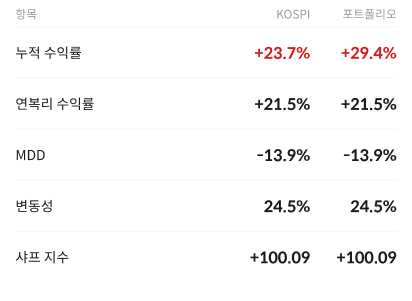
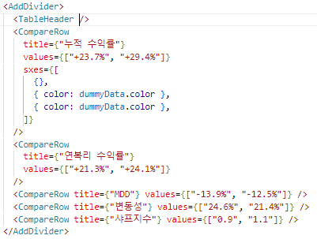
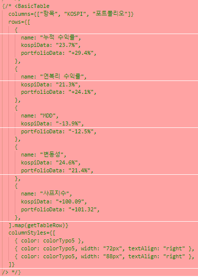

# 무엇이 좋은 컴포넌트화(Componentize)인가?
### 23/08/02
Table 컴포넌트를 만들고 사용하는데 너무 복잡하다는 느낌을 받았다. 바로 쓰지 못하고, 사용법을 계속 찾아가야했다. 이건 좋은 구성이 아니라고 생각했다. 따라서 문제를 고민해 보았고, 이내 너무 큰 자유도를 컴포넌트화 하려했다는 사실을 깨달았다.  
나는 테이블의 각 셀의 요소들을 모두 컨트롤 할 수 있으면서, 데이터만 주입하면 사용할 수 있는 형태의 컴포넌트를 상상했으나, 당연히 상충되는 조건이었기에 복잡한 형태가 되고 말았다.

따라서 자유도와 간편성 사이에서 선택을 했어야 했다. 아직 제품의 변경사항이 쉽게 발생할 수 있다고 생각하였기에 자유도를 선택하였고, 하나의 테이블 컴포넌트가 아닌 여러개의 컴포넌트로 분리해 보았다.

1. 테이블에서 반복적으로 발생하는 하단 border 추가를 AddDivider로 만들어 주었다. 마지막 행인 것을 판단하면 divider를 넣지 않고, 나머지 사이에는 모두 divider를 추가해준다.
2. TableHeader, CompareRow로 나누어서 테이블을 분리시켰다. 그리고 CompareRow의 경우 custom이 가능하도록 sx배열을 넘길수 있게 해주었다. 오히려 이렇게 작성한 코드가 훨씬 읽기 쉽다고 느껴진다.

