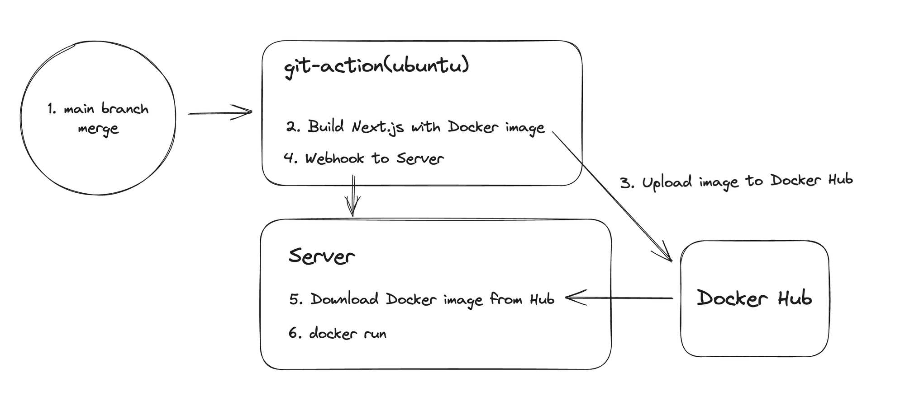

<aside>
    특정 회사가 명시되는 내용은 제거했습니다.
</aside> 
 
# 번들러, Transpiler

1. 번들러가 무엇인가?
    1. 여러개의 파일을 하나로 묶어주는 도구입니다. webpack, rollup, ESBuild, swc, vite이 대표적입니다.
    2. 각각의 특징을 아는가?
        1. webpack은 오래된 번들러이며, 생태계가 가장 큽니다. code splitting으로 파일들을 여러 번들로 분리해서, 병렬로 다운로드를 가능하게 만들어 페이지 초기 로딩 속도를 개선할 수 있습니다
    3. rollup이 무엇인가?
        1. 라이브러리를 만들 때 주로 사용하는 번들러입니다. 저도 이번에 svgEmbedder 프로젝트를 진행하면서 사용해 봤습니다. weback은 CommonJS를 사용하고, rollup은 ES6를 사용합니다. 따라서 tree shaking이 webpack보다 더 잘 작동하여서, 더 가벼운 번들을 생성합니다.
    4. parcel이 무엇인가?
        1. zero conifg를 지향하는 번들러입니다. 다른 툴에 비해 생태계가 작습니다. 간단한 어플의 경우 사용할 수 있습니다.
    5. ESBuild가 무엇인가?
        1. JS가 아니라 Go로 작성된 번들러로, 매우 빠릅니다. 생태계가 아직 성장중입니다.
        2. 그래서 snowpack이 실제 개발에 필요한 기능들을 esbuild에 추가하여서 등장했습니다. 개발시 모듈별로 빌드를 따로 하여서, 번들링을 하지 않아서, 더 빠르게 수정사항을 반영할 수 있습니다.
    6. Vite(비트)는 무엇인가?
        1. vue의 개발자 evan you가 만들었으며, snowpack의 단점들을 개선해서 등장한 번들러입니다.
    7. swc이 무엇인가?
        1. nextjs에서 채택한 rust 기반 개발 툴입니다. babel, terser를 대체합니다. 
        2. nextjs는 turbopack으로 webpack을 대신하고, vite와 경쟁하려 합니다.
2. commonjs와 esm에 대해 설명?
    1. 애초에 JS는 브라우저에서 동작하고, script로 다운받아서 동작했습니다. 따라서 모듈 개념 자체가 없었습니다. 따라서 이를 위한 규격인 commonjs가 등장했습니다. 그리고 ES6에서 module 시스템이 등장하면서 표준화가 되었습니다. 하지만 아직 Commonjs로 작성된 코드들이 많기 때문에, 두가지 모듈 방식이 남아있습니다.
        1. https://stackoverflow.com/questions/70691479/is-commonjs-require-still-used-or-deprecated
    2. cjs는 require/module.exports, esm은 import/export를 사용
    3. cjs는 동기적으로, esm은 비동기적으로 작동
        1. esm은 top-level await을 지원하여 비동기적으로 작동합니다.(모듈 자체에 async가 이미 선언되어 있어서 모듈 body에 await을 작성할 수 있음)
        2. 따라서 esm은 cjs를 import할 수 없지만, cjs에서 esm을 require할 수는 없다. cjs는 top-level await을 지원하지 않기 때문이다.
        3. 이외 다양한 이유로 호환이 힘들다
    4. ssr에서 사용하려면 cjs를 지원하는 것이 중요하다.
        1. nodejs 기반으로 동작하기 때문에
    5. esm에서 treeshaking은 제대로 동작한다.
        1. cjs는 require/module.exports를 동적으로 하는데 아무런 제약이 없다. 따라서 빌드시 정적 분석이 힘들다.
        2. ESM은 정적인 구조로 모듈끼리 의존하도록 강제한다. 따라서 정적 분석이 가능하다.
    6. package.json에서 exports field로 esm, cjs를 구분해서 읽어들이게 할 수 있다.
        1. main/module로 구분 가능
3. rollup으로 번들링시 esm, cjs 폴더가 생긴다. 왜 그런가?
    1. esm 사용자와 cjs 사용자 모두 만족시켜주기 위해서 그렇다.
    2. https://toss.tech/article/commonjs-esm-exports-field
    3. https://roseline.oopy.io/dev/translation-why-cjs-and-esm-cannot-get-along
4. babel이 무엇인가?
    1. babel은 ES5와 같은 하위 브라우저에서도 ES6이상의 문법을 사용할수 있게 코드를 변환해주는 transpiler이다.
    2. 더 최신기능들은 polyfill을 통해서 추가로 관리할 수 있다.
5. typescript에서도 ES5로 target을 지정할 수 있는데 왜 babel을 쓰는가?
    1. 일단 목적이 다르다. 그리고 typescript를 es6로 target해야 번들링때 treeshaking을 사용할 수 있다.
    2. terser에서 minify할 때 사용되는 pure annotation을 babel은 붙여주지만, ts는 붙여주지 않는다. 따라서 babel을 이용해 컴파일 하는 과정이 필요하다. 그래야 side effect가 없다고 판단해서 tree shaking때 제거할 수 있다.
6. chunk로 어떻게 나누는가?
    1. Nextjs는 page단위로 알아서 나눈다
        1. 이걸 어떻게 분리하는가?(프레임워크, 중복 라이브러리, 페이지, …)
7. 라이브러리에 babel을 추가해야하는 이유가 무엇인가? 중복으로 babel이 적용되는 것 아닌가?
    1. 사용자가 babel을 사용할지 안할지, 확신할 수 없기 때문에 babel을 사용한다.
    2. babel7으로 넘어오면서 모듈들에 대해서는 babel을 진행하지 않는 기조가 생겼다. 모듈까지 babel을 적용하려면 설정 파일을 변경해야한다.
8. sourcemap이 무엇인가
    1. https://joshua1988.github.io/webpack-guide/devtools/source-map.html
    2. 배포용으로 빌드한 파일과 원본 파일을 연결시켜주는 기능. 즉 디버깅을 위해 압축된 코드의 특정 부분이 원본 소스의 어떤 부분인지 확인하는 것
    3. typescript에서 sourcemap은 변환된 js 파일과 ts파일과 연결시켜주는 역할을 한다.
9. css-in-js의 단점?
    
    장점
    
    1. 지역 스코프 스타일링(충돌 피하기 쉽다)
    2. 스타일을 같은 파일에 위치시킬 수 있다. (colocation)
    3. js 변수를 style에 사용가능
    
    단점
    
    1. CSS-in-JS는 런타임 오버헤드를 더한다.(serialize 과정이 들어간다)
    2. CSS-in-JS는 번들 크기를 늘린다.(거대하진 않지만, 커진다)
    3. CSS-in-JS는 React DevTools를 어지럽힙니다
    4. CSS 규칙을 자주 삽입하면 브라우저에서 더 많은 작업을 수행해야한다.
    5. SSR에서 제대로 동작하지 않을 수 있다.
        1. Emotion 인스턴스가 한 번에 로드된다
        2. 스타일 삽입 순서를 완전히 제어할 수 없다.
        3. SSR이 리액트 18에서 다르게 작동한다.
    
    해결법
    
    1. 한번만 직렬화 되도록 `@emotion/react`의 `css`함수를 사용
        1. 스타일에서 프로퍼티에 접근할 수 없으므로 장점 하나를 잃는다.

# 리액트, 넥스트

1. useMemo나 useCallback으로 최적화를 어떻게 하는가?
    1. 비싼 연산을 caching함으로서 불필요한 연산을 제거한다.
2. nextjs에서 hydration이 있는데, token 관리는 어떻게?
    
    (네이티브에서 로그인하여, 토큰을 관리하고 있다고 가정)
    
    1. SSR을 하는 부분은 token과 무관한 부분만을 렌더링 해야한다.
    
    또는
    
    1. client에서 페이지 진입시, token을 검증하고, 그것을 쿠키 or localstorage로 관리한다.
        1. next/headers 를 통해서, cookie를 얻어낼 수 있다.
            1. get함수로 header의 값 자체를 얻을 수도 있다(`header.get('authorization')`)
3. Nextjs v13의 렌더링 방식을 아는가?
    1. app router가 등장했고, server component가 적극적으로 도입되고있다.
    2. client component와 server component로 나뉘어진다.
        1. client component는 기존의 page router의 ssr과 동일하게 작동하고, server component는 서버에서 렌더링을 마친 뒤에 전달해준다.
        2. 기존에는 page-level이었다면 이제 component-level로 관리된다.
        3. app router는 기본적으로 server component이다
    3. static rendering과 dynamic rendering으로 나눌 수 있다.
        1. static은 build 타임에 생성된다. 이는 ISR(Incremental Static Regeneration), SSG(Static Site Generation)과 동일하다.
        2. fetch도 cache되어서 빌드타임에 미리 렌더할 수 있다
            1. revalidate 가능
4. /app router와 /page router가 무엇이 다른가?
    1. page router는 기존의 SSR을 생각하면 될 것 같다. 서버에서 렌더링 가능한 부분들은 렌더링을 미리하고, 나머지는 client에서 처리한다.
    2. approuter는 server component를 더 적극적으로 도입한 기능이다. 기본적으로 server component를 지원하고, use client를 사용하면 page router와 동일하게 작동한다. 차이점은, 기존에는 page단위였다면, 이제 컴포넌트 단위로 서버와 클라이언트가 렌더링위치를 다르게 줄 수 있다는 것이다. 또한 만약 static하다는 것이 next.js에게 판단되면 build떄 삽입되어서 렌더링 될 수도 있다. 그리고 layout 개념이 생겨서, 반복해서 렌더링되는 부분을 Static Site Generation으로 처리할 수 있다.
5. server component와 SSR를 비교하라
    1. server component의 js는 클라이언트로 전달되지 않고, SSR의 JS 코드는 전달된다.
    2. Server component는 페이지 단위가 아닌 컴포넌트 단위로 서버에 접근가능하다.
    3. **server component는 클라이언트 상태를 유지하며 refetch될 수 있다.**
        1. next.js에서는 `router.refresh`를 통해서 server component를 업데이트 할 수 있다. 당연히 `cache: ‘no-store’` 조건 필요
        2. https://stackoverflow.com/questions/75124513/update-server-component-after-data-has-been-changed-by-client-component-in-next
6. rect-query를 써보았는가?
7. react-query와 swr의 차이를 아는가?
    1. reacy-query: 서버 상태 가져오고, 캐싱하고, 동기화하고, 업데이트한다.
    2. swr: 캐시에서 데이터를 반환한 다음, 서버에 데이터를 가져오고, 마지막으로 최신 데이터를 제공 하는 전략
    3. rq는 오프라인 상태에서 뮤테이션(post/patch/put/delete)을 시도하면 잠시 멈추고, 온라인 상태가 되면 다시 시도한다.
    4. rq가 swr보다 조금 더 기능이 많다.

# 잡다

1. OAuth에서 token관리를 어떻게 하는가?
    1. Authorization code를 프론트에서 수신하고, 이를 다시 백엔드로 넘겨서, 백엔드에서 accessToken을 받고 저장한다.
    2. https://next-auth.js.org/configuration/options
        1. The default is `"jwt"`, an encrypted JWT (JWE) stored in the session cookie.
        2. accessToken은 없다. 필요할 때 가져온다.
        3. 대신 jwt로 session cookie를 브라우저가 가지고 있어서, 이것으로 referesh 가능
        4. [server-readable-only cookie](https://developer.mozilla.org/en-US/docs/Web/HTTP/Cookies#restrict_access_to_cookies)
            1. HttpOnly cookie는 document.cookie로 접근할 수 없고, 서버에서만 접근할 수 있다.
            2. 저장되는건 browser’s Cookie storage
        5. 그래서 백엔드에게 accessToken을 넘겨주려면 client→server→(Backend)API 로 넘겨줘야한다.
            1. **server에서 accessToken이 발급 되면, backend에게 로그인 성공을 알리고, ok가 넘어오면, client에게 로그인 성공을 알려준다.**
        6. DB를 쓰면 더 안전하다.
2. 왜 Flutter를 사용했는가?
    
    [https://velog.io/@error/Flutter-2.-플러터의-렌더링](https://velog.io/@error/Flutter-2.-%ED%94%8C%EB%9F%AC%ED%84%B0%EC%9D%98-%EB%A0%8C%EB%8D%94%EB%A7%81)
    
    1. 다른 크로스플랫폼 앱들은 네이티브 코드와 상호작용해 드로잉을 수행했다면, 플러터는 자신의 UI 코드를 사용해 드로잉을 수행한다. 렌더링 성능이 더 좋다.
    2. 플러터는 google이 버릴 수 있는 프로젝트라는 두려움에 잠시 주춤 했었지만, 다시 구글에 서포트를 받는 모습을 보여주면서, 다시 트렌드를 차지하고 있었기 때문에 선택했었다.
    3. 선택할 당시에는 react를 고려하지 않고 있었고, 실력이 성숙하지 않았었다.
3. atomic pattern의 단점을 느낀점 있는가?
    1. atom의 “더 이상 분해되지 않는 것”의 기준이 애매하다.
    2. 불필요한 분리가 발생할 수 있다.
    3. 분리의 기준이 모호할 수 있다
        1. →나는 맥락으로 구분지었다. 코드가 어디에서나 사용가능하면 atomic, 아니면 organisms로 이동시켰다. atomic은 기능을 기준으로, organism은 페이지를 기준으로 폴더구조를 가진다. 포트폴리오에만 쓰이는 organism은 포트폴리오 organism 하위에 있는 방식이다.
        2. 단점
            1. 페이지에서 단 한번 쓰이는 컴포넌트는 분리하지 않고 있는데, 이게 너무 길어지는 경우가 발생해서 어떤건 organism, 어떤건 페이지에 존재하는 불확실성이 있다.
            2. 디자인 시스템이 제대로 갖추어지지 않아서 발생하는 문제라고 생각한다. 더 많이, 충분한 컴포넌트 시스템을 갖추면 문제가 없을 것 같은데, 현실적으로 지금은 좀 힘들긴하다. 이정도 부채는 들고 가되, 디자이너와 협업하여 필요한 컴포넌트를 더 만들어 내면 점진적으로 해결할 수 있다고 생각한다.
4. 다른 패턴은 뭐가 있는가?
    1. 기존 패턴은
        1. 공유되는 컴포넌트는 전부 shared로 사용
        2. layout은 layout으로
    2. 디자인 시스템에 맞추는 방식. 큰 수정 없이 구성할 수 있을 것 같다.
5. DI(dependency injection), Algebraic Effects(대수적 효과)를 아는가?
    1. 자신을 감싸는 부모 컴포넌트가 할일을 대신 해주는 방식.
    2. children을 전달하면서 구현가능
    3. errorBoundary를 구현한게 인상적이었다.
6. yarn, npm, pnpm에 대해 아는가?
    1. npm의 매우 비효율적인 node_modules 구조로 다양한 패키지 관리 도구들이 등장했다.
    2. yarn v2 이후가 yarn berry. pnp를 지원한다.
    3. pnpm은 nested되어있지만 content-addressable stroage로 물리적으로는 한 번만 설치될 수 있도록 설정했습니다.
    
# 경험(인성)

1. 커뮤니케이션을 잘 했던 실제 사례를 얘기해 달라
    1. 커리어다이브에서 기획자와 커뮤니케이션 했던 경험이 있다. 
        1. 기획자들의 요청이 우선순위를 무시.
        2. 로드가 너무 커져서 프로젝트 전체 진행 자체가 느려짐. 
        3. 우선순위를 모두가 볼 수 있게 **칸반보드 형식** 정리
        4. 기획자가 특정 요청을 할때, 해당 요청으로 인해서 발생할 다른 문제들을 설명
        5. 그렇게 회의를 진행하여서 회의 시간도 줄어들고, 프로젝트 진행 시간도 훨씬 가속 시킬 수 있었다.
    2. 데이콘에서 대표님이 여러가지 작업을 정말 산발적으로 요청
        1. 그때 당시 리팩토링을 하고 있었기 때문에 대부분 사라질 개발사항들이었다. 
    3. 그래서 회의 시간 때, 리팩토링이 진행되고 있는 페이지를 모두 접속할 수 있게 한다음, 볼 수 있게 하였고, 요청 받은 수정사항들이 리팩토링 페이지에서 모두 해결되고 있기 때문에 리뉴얼 페이지를 빨리 출시하자는 쪽으로 의견을 모을 수 있었다.
2. 내가 개발한 것 중에 가장 잘 풀어낸 문제는 무엇인가?
    1. typescript로 복잡한 obejct를 redux에서 쓸 수 있게 만든 작업
        1. 문제를 정의하고, 해결하기 위해서 올바른 방향으로 공부를 한 다음, 원하는 수준까지 사용성을 끌어올린 이 sequence가 가장 기억에 남는 경험.
        2. 어떤걸 공부했는가?
            1. typescript 문제들을 많이 풀어보았고, 그러면서 공식문서를 여러번 읽었었다. 
            2. 기억에 남는 문법은 conditional type으로, recursive한 type을 만들어내는 것이다. 이때 타입스크립트를 추가로 공부해야겠다는 생각이 좀 더 강하게 들었다.
    2. soft skill적으로 기억나는 경험은, DACON에서의 리뉴얼 작업이었다. 
        1. 3개월정도, 긴 호흡으로 진행되는 과정중에 다른 직군들에게 프론트엔드의 상황을 잘 설명하고, 공감을 얻어냈었다.
        2. → 열심히 하는 모습을 보여주고, 작업과정을 실시간으로 보여줬다.
        3. 들어오는 요청들의 우선순위를 선별하고, 우선순위가 변경될때 발생할 일을 어쩌면 건조하게, 팩트를 전달하는데 집중했다. 그렇게 주도적으로 프로젝트를 진행했었다.
3. 나의 어필 포인트가 무엇인가?
    1. 어떤 그룹에 놓여지더라도, 내가 할 수 있는일, 해야하는 일을 잘 알아차리고, 그것을 위해 필요한 환경을 만드는 것을 잘한다. 여기서 환경은, 공부가 될 수도 있고, 사람과의 커뮤니케이션이 된적도 있었다. 최종적으로 이 과정속에서 팀에게 필요한 자원이 되면서 성장하는 것. 이것이 내가 잘하는 일이다.
    2. 이를 필요 조건은 신뢰이다. 내가 남을 신뢰하는 것이 아니라, 남이 나를 신뢰하게 만드는 능력을 말한다. 그리고 이 능력은 꾸준함과 진실성에서 나온다고 생각한다. 내가 능력이 충분한 상태로 팀에 합류할때도 있지만, 그렇지 않을 때도 많았다. 그럼에도 시간이 지날수록 팀의 주축으로 이동한 경우가 대부분이었다.

# 포트폴리오 질문

1. Next.js를 도입하여서 하이브리드 앱으로 전환
    1. 왜 Next.js를 썼는가?
        - 빠른 개발이 목표이고, 혼자서 개발해야하기 때문에 알고있는 기술스택에서 선택해야했음.
        - Next.js
            - 현재 백엔드는 Go로 짜여져있고, 조금 불안함(최초 설계한 백엔드 개발자가 회사에 없음)
            - JavaScript를 공부하는 팀원이 있기 때문에, 프론트엔드/백엔드 역할도 가능한 Next.js 선택
            - 블로그 개발시 사용해본 경험이 있음
            - 초기 로딩 속도가 빠른 것이, 하이브리드 앱을 조금 더 “앱” 스럽게 보이게 만든다고 생각한다.
    2. 왜 순수 React를 쓰진 않았나? SSR이 꼭 필요했나?
        1. SSR이 필수적이진 않았다. 하지만 React 공식문서에서 CRA(Create React App)으로 시작하는 내용을 삭제했고, React framework를 추천하기 때문에, 그중에서 사용 경험이 있던 Next.js를 선택했다.
        2. 초기화면 로딩시간이 짧기 때문에 하이브리드 앱에 더 적합하다고 느꼈다.
    3. SSR인 Remix는 왜 사용하지 않았나
        1. 사용 경험이 없었고, 더 큰 생태계를 가지고 있는 next.js가 빠르게 개발하는데 더 적합하다고 생각했다. 그래야 더 많은 정보를 가진채로 개발할 수 있기 때문이다.
    4. 자동 배포는 어떤식으로 진행했는가?
        1. 그림
            
            
            
            빌드 및 webhook 전달 과정
            
        2. git-action과 docker, 그리고 webhook을 사용했다.
        3. 먼저 main branch에 merge가 발생하면 git-action이 시작된다
        4. git-action은 ubuntu 서버이며, main branch의 코드를 바탕으로 Docker image를 빌드한다.
        5. 빌드가 완료된 image 파일은 docker hub에 올라간다. 이때 docker hub의 계정 정보는 github에 secret value로 저장해서 사용했다.
        6. docker hub에 업로드가 완료되면 배포 서버로 webhook 요청을 날린다.
        7. 서버에는 webhook 요청을 받을 수 있도록 수신 서버를 설치했다. 그리고 webhook을 받으면 작성해둔 sh파일을 실행한다.
        8. sh파일에는 docker hub로 부터 이미지를 받고, docker-compose를 실행한다.
        9. docker compose에는 next컨테이너와 https을 설정하기 위한 `letsencrypt` 컨테이너가 정의되어 있다.
        10. 이 때, 환경변수파일을 next 컨테이너에 연결해준다. 이를 통해, 공개되지 말아야하는 env들을 github에 올리지 않고 관리할 수 있다.
    5. 추후 개발될 웹 기반의 서비스의 구현이 어떤 의미인가?
        1. 회사에서 데이터 판매를 위한 웹 서비스를 따로 구상중이었다. 하이브리드 앱으로 전환하기 전까지는, 해당 서비스는 완전히 개별적인 서비스로 생각되었다. 하지만 하이브리드 앱으로 전환하고 나니, 둘 다 웹 서비스가 되었으며, 비슷한 데이터들을 사용하기 때문에 컴포넌트와 디자인을 공유하는 등, 훨씬 빠르게 개발을 진행할 수 있는 상황이 만들어졌다.
    - 참고
        - Remix
            - next와 비슷함. react-router를 만든 팀에서 만든, Full-stack framework
        - Gatsby
            - 정적 사이트 배포시 사용
        - Expo
            - react-native와 같은 cross platform 프레임워크
    
2. OS별 Flutter의 웹뷰에서 발생하는 부자연스러운 부분들을 개선
    1. iOS에서 백스와이프시 뒤로가기가 되지 않는다는게 무슨 뜻인가?
        1. 로그인 화면과 홈화면은 Flutter로, 그리고 특정 시퀀스에 진입하면 웹뷰를 그리는 형식으로 앱이 구성되어 있었다. 이 때, 웹뷰로 진입한 다음, 페이지를 이동한 뒤에, iOS의 백스와이프를 하면 웹뷰에서 뒤로가기가 되지 않고, 웹뷰 자체를 닫아버렸다.
        2. Flutter에서 스와이프 옵션을 켜줘야 해당 기능을 사용할 수 있었는데, 그걸 켜버리니 실제로 웹뷰가 닫혀야하는 시퀀스의 진입점에서 조차 웹뷰가 닫히지 않았다.
        3. 결국 웹뷰가 바로 닫히거나, 웹뷰를 나가지 못하거나. 배타적인 상황에서 필요한 기능만 뽑아낼 필요가 생겼다.
        4. 따라서 이 배타적인 상황을 분기하는 조건을 따져봤다. 하나는 스와이프 옵션의 활성화였고, 나머지 하나는 시퀀스의 진입점 여부였다.
        5. 그렇기 때문에, 시퀀스의 진입점인지 아닌지를 url을 통해 판단하여서 스와이프 옵션의 활성화/비활성화를 제어하면 된다고 판단을 했다.
        6. 그러려면 flutter에서 현재 webview의 url을 알아야하는데, flutter에서는 라우팅시의 url만 확인할 수 있었다. 그런데 SPA에서의 라우팅은 flutter가 감지하지를 못한다.
        7. 따라서 web에서 flutter에게 다른 방식으로 url을 알려줘야했다. 그래서 addJavaScriptChannel이란 방식을 구현해서, next에서 routing을 할 때마다 flutter에게 url을 알려주고, flutter는 이 url을 확인해서 스와이프 옵션을 제어한다. 이를 통해 백스와이프를 적절하게 사용할 수 있게 되었다.
        8. 현재는 로그인페이지까지 웹뷰로 구현하여서 이 기능은 비활성화 되어있기는 하다. 하지만 충분히 다른 페이지가 flutter로(native로)구현될 가능성이 있기 때문에, 가치있는 경험이라고 생각한다.
    2. 안드로이드에서 간편결제를 위한 deeplink가 열리지 않는 문제
        1. 상황설명
            1. 포트원(구 아임포트)를 사용해서 개발을 했는데, 간편결제에서 뜨는 deep link들이 iOS는 모두 잘 구현되는데 android에서는 제대로 뜨지 않는 문제가 있었다.
            2. deeplink를 확인해보니 iOS와 android에서 다르게 보여줬다. android는 intent://로 시작하는 url을 가진 서비스들이 많았었다. 그래서 추가로 조사를 해보니, android는 intent://로 받은 url을 Intent객체로 분석해서 이동하게 되어있었다.
            3. 이 url은 실제로 이동하는 것이었기 때문에 flutter에서 잡아내는 것은 어렵지 않았다. 하지만 android Intent로 분석을 해야하는데, Flutter는 그 기능을 제공하지 않았다. OS specific한 기능은 따로 구현하게 되어있었다.
            4. 그래서 MethodChannel을 만들어 안드로이드로 해당 url을 보낸뒤, Intent를 실행할 수 있는 URL로 parse한 다음 반환했고, 그 URL로 이동하게 구현해서 해결했습니다.
    3. 해당 부분을 웹뷰로 구현하지 않고, flutter로 구현하는 것은 고려하지 않았나?
        1. 고려했었다. 하지만 웹뷰에서도 결제가 되는 것을 확인했고,결제 api들의 공식문서에 하이브리드앱에 대한 얘기가 있어서 굳이 flutter로 구현하지 않았다. 앞서 설명한 문제 처럼(해결했지만), platform을 옮기며 개발하는 것은 예상하기 힘든 버그를 만들어 낼 수 있다고 생각한다.
        2. 어플로 연결만 시키면, 그 후는 결제 어플이 처리해주니 연결 부분에만 집중했고, 웹뷰로 구현할 수 있다고 생각했고, 구현해냈다.
    4. 토스는 이를 어떻게 해결했는가?
        1. 네이티브팀과 협력해서 해결하는가?
3. Next.js에서 앱과 유사한 개발자 경험을 주는 [Custom Hook을 구현](https://blog.steinjun.net/posts/25)
    1. 어떤식으로 구현했나?
        1. useContext를 사용해서, 최상위 컴포넌트의 AppBar를 각 페이지에서 제어할 수 있게 만들었다.
        2. useContext에는 옵션을 여러가지 전달할 수 있게 만들었다.
            1. type, title, color, tailNode, backUrl이다.
            2. 내가 생각한 appBar가 필요한 속성들을 추상화 시킨것이다.
        3. useContext를 사용할 때, 개인적으로 별로라고 생각하는 코드가 Context를 import해오는 부분이었다.
            1. 어디에, 어떤이름으로 선언되어 있는지 알아야하는데 특정 컴포넌트 내부에 존재하는 것도 아니며, 이름도 컨벤션을 지키지 않으면 자동 Import로 찾기도 힘들다.
            2. 이를 CustomHook내부에 넣으므로써 CustomHook만 알고 있다면, 해당 context 객체는 몰라도 기능을 사용하는데 전혀 문제가 없다.
            3. 그리고 appbar의 색상을 flutter로 전달하여 status bar의 색상을 일치시킬 수 있게 만들었다.
        4. usePageColor의 경우, 최상단 css를 변경하는 식으로 간단하게 custom hook을 구성했다.
        5. 개인적으로 만들고 가장 잘 쓰고 있는 컴포넌트중 하나며, 사용자(개발자) 친화적인 컴포넌트라고 생각한다.
    2. 문제는 없는가?
        1. AppBar에 넣어야할 데이터가 api로 인해 나중에 얻게 된다면, useEffect 내부에 들어가게 되는데, 그러면 react의 hook 규칙을 벗어나게 된다. 따라서 CustomHook을 사용하지 못하고 그냥 useContext를 사용해야한다.
    3. redux가 구현되어 있는데, 왜 context를 사용했나?
        1. 사용하면서 느꼈는데 개인적으로 context는 theme과 같이 가벼운 데이터를 다룰 때, redux는 복잡한 데이터와 로직을 다룰 때 사용하는 것이 적합하다고 느꼈다. 튜토리얼에서 context는 dark/light theme으로 설명하고, redux는 counter를 예시로 설명하는 것 처럼. 
            1. context에서 여러 변수를 사용하려면 어쨌든 useState로 많은 state를 만들어 내야하는데, 이 코드가 별로 보기 좋지 않다고 느꼈다.
                1. 단일 객체로 만들어서 수정할 수도 있겠지만, 타입도 설정해줘야 하며, 객체를 쓸정도의 사이즈의 데이터면, 복잡한 로직을 가질 것이기 때문에, 적절하지 않다고 느낀다.
                2. 그리고 코드가 파편화 되는 느낌을 받는다. Context를 선언하는 곳, state를 주입하는 곳, 사용하는 곳 모두 정돈되지 않는 느낌.
            2. redux는 Redux Tool Kit을 쓰더라도, boilerplate코드가 많다. 하지만 크고 많은 데이터들이 그런 boilerplate로 인해서 오히려 더 분리되고, 엄격하게 관리되어서 문제의 여지가 줄어든다고 느꼈다. 물론, redux에서 데이터(state)를 변경하는 일은 너무 귀찮다.
        2. 결론적으로, appBar의 내용은 theme과 같이 가벼운 정보라고 판단했고, 그렇기에 context를 사용했다. 더 복잡한 작업을 해내야한다면 redux로 옮기겠지만, 그건 서비스가 훨씬 커진 뒤의 일일 것 같다.
4. TypeScript와 Redux로 복잡한 interface(type) 구현
    1. 상황 설명
        1. 포트폴리오를 생성하기 위한 옵션들은 매우 많다(50개 이상. 무한히 추가 가능)
        2. 그 중에서 재무적, 기술적 지표를 넣을 수 있는데, 이부분이 문제였다.
            1. 다른 옵션들은 1-depth로 데이터를 표현하지만, 이부분은 3-depth로 내려간다
        3. 팩터>카테고리>지표>데이터
        4. 그렇게 하니, 기존에 1-depth에서는 전혀 문제가 없던 type 부분들이 전부 무너졌다.
        5. 이를 처리하기 위해서 우선 TypeScript 공부를 진행해 실력을 키웠다. 그렇게 type에 대한 이해도를 높인 다음 문제를 분석했다.
        6. 일단 redux의 reducer의 구조를 짜는 것이 힘들었다
            1. redux에서 key값을 string으로 받아서 원하는 부분의 객체만 업데이트 하는 방식을 사용했다.
            2. 1-depth일 때는 type 추론이 완벽하게 되어서, 알맞지 않는 값은 읽지도, 쓰지도 못하게 에러가 발생했다.
            3. 하지만 depth가 깊어지니 이 부분들을 제대로 처리하지 못하였다.
            4. keyof를 연속해서 사용하니 원하는 key값을 제대로 뽑아내지 못해서 unknown, any등의 상황이 계속 발생했다.
        7. 상단부의 타입에 하위 타입들을 명시하는 방식을 사용하여 문제를 해결했다.
        8. typescript 덕분에(믿기도 하고) string으로 key값을 넘겨도, typecheck가 안전하게 되었다. 그렇지 않았다면, reducer를 전부 작성했어야 할텐데, 그런 불상사를 넘겨서 다행이다.
        9. 상위 타입에 명시를 하니, 너무 빡빡하게 들어가서 `{[others:string]:any}` 라는 type을 쓸 수 밖에 없는 상황이 왔었다. 그래서 해당 key값에 없는 키를 대입해도 에러가 발생하지 않는 문제가 있다.
        10. 개인적으로 조금 더 나은 방법을 찾아내고 싶기 때문에 typescript를 더 많이 공부할 예정이다. 이런 type문제와 이런 큰 객체를 프론트에서 처음 사용해봐서 해결이 어렵다고 느껴진다.
            1. 하지만 구조적으로 문제인지
            2. 타입을 제대로 부여하지 못한건지
            3. 사용하는 방식의 문제인지(제네릭을 부여해야한다거나)
    2. reducer를 각각 짤 수 있는데 왜 string으로 구현했는가?
        1. 별도의 로직은 없고, 데이터의 읽기/쓰기가 주된 작업이었다. 그런데 이것이 여러 페이지를 오가며 사용될 수 있어야 하기 때문에 전역 상태 관리를 사용했고, 그 중에서 redux를 쓴 것 뿐이다. 따라서 reducer는 복잡한 로직을 처리하기 위해 존재하는 것이 아니게 되었다. 그래서 중복적인 코드를 적지 않으면서, 동일한 로직을 처리할 수 있는 방식을 만들기 위해 타입을 string을 통해 지정하는 방식을 구현해냈다.
        2. 그렇지 않으면 값의 변경에 따라 추가로 작성해야하는 코드(reducer)가 너무 많이 발생하게 되어, 코드량이 정말 많이 늘어난다.
        3. tyepscript가 있기 때문에 쓸 수 있는 방식이다. 그렇지 않았다면 reducer를 중복으로 정의했을 것같다. 아니면 다른 방식을 쓰거나.
5. 약 1년간 JavaScript로 개발한 React 코드를 TypeScript와 atomic pattern을 기반으로 기존 코드 리팩토링
    1. 새롭게 정의한 atomic design pattern에 대해 설명해줄 수 있는가?
        1. 기존의 atomic design은 atom, molecule, organism, template, page단위로 이루어져있다. 하지만 한명의 디자이너, 한명의 프론트 개발자가 atom과 molecule을 정의하고 사용하는 것은 너무 많은 사전 작업이 소요되는 일이라고 판단했다. 또한 template과 page 개념은 react에서 분리시키기는 어렵다고 생각했다.
        2. 따라서 atom,molecule을 component로, template과 page를 page로 단위를 통합시켰다.
        3. 그리고 Naver DEVIEW 2023에서 “atomic design 사용시, 구분의 단위를 정하는게 주관적이여서, 그 기준을 찾는게 어려웠다” 라는 얘기를 중복적으로 들었다. 따라서 그 기준을 정하고 들어가는 것이 중요하다고 느꼈다. 그리고 이전 단순한 component-page 구조에서 본인도, 명확한 기준을 세우지 않아서 컴포넌트들을 찾아가는데 힘들었던 경험이 있기 때문에 더 철저하게 고민해보았다.
        4. 컨퍼런스에서 들었던 얘기가, “MUI와 같은 컴포넌트 라이브러리가 제시하는 단위를 molecule로 정의하자” 였었다. 이 얘기에 영감을 받아서 세운 기준이 맥락(context)였다. MUI와 같은 컴포넌트 라이브러리에서 제공하는 컴포넌트는, 어떤 프로젝트이든, 페이지든 사용할 수 있다. 왜냐하면 그것은 맥락이 없기 때문이다. 하지만 커리어다이브에서 만든 “멘토 카드”는 멘토가 등장하는 페이지에서만 사용할 수 있다. 즉, 멘토라는 context가 생겼고, 이는 재사용성을 낮춘다. 재사용을 못하는 것과는 다르다. specific해 질수록 그 사용 도메인이 줄어드는 것이니.
        5. 따라서 모든 페이지에서 사용할 수 있는, 맥락없는 요소들을 component에 정의하고, 재사용은 가능하지만 특정 context에서만 사용할 수 있는 요소들을 organisms이라고 정의했다. 그렇게 organism과 component를 조합하고 배치해서 만드는것이 page이다.
        6. 여기서 style과 service, type도 추가하여서 자주 재사용되는 코드들을 묶어 놓았다. service에는 hook이나 자주 사용되는 함수를 정의했다.
        7. 그리고 마지막으로, 단 한 곳에서만 사용되는 코드는 별도의 코드로 분리하는 것을 최대한 피했다. 코드가 너무 길어져서 가독성을 위해 함수형태로 묶어낸 경우가 그런 경우겠다.
        컴포넌트가 너무 커서, 한 파일의 라인이 너무 길어지면 분리할 수 있지만, 그런 특수한 경우가 아니라면 페이지 파일에 위치시켰다. 
        왜냐하면, 코드가 분리되면 그 코드들의 응집도가 떨어진다고 생각했기 때문이다. 단 한 곳에서만 쓰이는 코드는 이미 최대치의 결합도를 가지고 있다. 그 결합도는 낮출 수도 없고, 낮출 필요도 없다. 왜냐하면 재사용 가능한 컴포넌트들을 사용해서 결국 최종적으로 도착한 컴포넌트이기 때문이다. 대부분 스타일을 수정하는 형태의 코드이다.
6. 복잡하고 버그가 많은 컴포넌트 개선
    1. 기존의 캘린더 코드는 state가 매우 많았고, useEffect로 그 변화를 모두 잡아내려고 했다.
    2. api로 값을 받아오는데, 그때의 비동기 처리도 제대로 제어하지 못했다.
    3. 게다가 애니메이션을 넣으려고 했다.
        1. 이때 높이를 반응형으로 만들어야 했기 때문에, 변화 직전에 계산해야했다.
    4. 그러다 보니 타이밍을 컨트롤하기 매우 어려웠고, 원하지 않는 로직, 애니메이션이 발생했다.
    5. 그래서 typescript로 먼저 리팩토링을 진행했었다.
        1. 매우 바보같았던게, 날짜 변수를 string으로 관리했었다. 정말 엄청나게 복잡했다.(null check)
        2. 그래서 typescript를 통해서 타입을 강제했고, null check 코드들을 없앴고, 가독성을 대폭 향상시켰다.
    6. 그럼에도 불구하고 버그를 완전히 잡아내지 못했다. state가 너무 많아서 useEffect에서 sideEffect가 발생하는 조건을 제대로 찾지 못했기 때문이다.
    7. 그때 react 공식문서를 다시 한번 살펴 보았고, useReducer를 알게되었다.
    8. state와 로직을 한곳에서 제어하니 더이상 헷갈리지 않았고, 이벤트를 모두 제어하게 되면서 버그를 잡은건 물론이고 애니메이션도 안정적으로 넣을 수 있었다.
    9. 이론적인 준비가 좀 더 필요하다는 것을 느낀 경험
7. DACON 리팩토링
    1. 컴포넌트 페이지 형태로 어떻게 바꾸었는가?
        1. 코드의 로직을 전부 새롭게 만드는 것은 리스크가 크다고 판단했다. 모든 코드들이 왜 존재하는지 파악하지 못했기 때문에 필요없다고 생각해서 지우는 코드들이 문제를 발생시킬 수 있기 때문이었다(하드코딩된 값들이라거나). 그래서 중복적으로 보이는 코드들을 묶어내는 형식으로 컴포넌트화를 진행했다. 특히 dynamic routing을 더 적극적으로 활용해서 중복적인 페이지를 많이 제거했다. 동일한 페이지인데 3개 정도의 파일로 존재했던 곳이 있었다(글작성 페이지).
    2. 하면서 가장 힘들었던 부분은 어떤 부분이었는가?
        1. 코드를 파격적으로 바꾸는 부분 그 자체가 힘들었다. 우선 노드 버전을 8에서 14로 올렸고 대부분의 패키지들을 업데이트 했었다. 그 때, 어떤 코드가 어떤 라이브러리를 사용하는지 전부 파악이 안됐기 때문에 매우 부담스러웠는데, 대부분 별 문제 없이 지나가긴 했다.
        2. 그리고 반응형 구현이었다. 애초에 이 리뉴얼 자체가 반응형을 지원하기 위해 시작하였기 때문에 가장 공을 많이 들였다. 하지만 반응형을 고려하지 않고 만든 디자인들이 다수 있었기 때문에, 이 부분은 내가 직접 보면서 자연스럽게 만드는 작업을 진행했었다. 모든 width에서 자연스러워보이게 만들고 싶은 욕심이 컸어서, 시간을 매우 많이 썼다. 버그도 많이 발생했어서, 여러기기에서 팀원들의 버그리포팅을 받아가며 수정작업을 했었다.
        3. 그리고 API를 하나의 파일로 몰아서 정리하는 작업에 공을 들였었다. API들이 함수 형태로 존재하지 않고, 여기저기에서 axios로 요청을 보내고 있었는데, 이들을 전부 찾아내서 하나의 파일로 정리했다. 통일된 규격으로 만드는 부분이 그때 당시에 힘들었던 기억이 난다.
    3. Vuetify 커스텀 방식이 무엇인가?
        1. 거창한것은 아니고, Vuetify에서 제공해주는 컴포넌트를 기반으로 서비스에 맞게 수정해서 사용했다. 기본적으로 제공해주는 효과들, 버튼에서 ripple과 같은 효과들을 별다른 수정없이 사용할 수 있었다.
        2. 하지만 그 때 당시에는 styling 실력이 아직 부족했어서, 내부에 있는 css요소들을 다루는게 힘들었던 기억이 난다. 그래도 그 때 실력이 많이 늘기도 했다. 참고로 이때 진행한 방식을 토대로 react에서는 MUI를 활용하는데 지속적으로 노하우를 가지고 작업할 수 있었다.
        3. 아쉬웠던건, vuetify에서 제공한걸 커스텀하고, 다시 그것을 컴포넌트화 할 생각을 하지 못했기 때문에, 중복적인 styling이 발생했었다. 돌아간다면 그 부분에 대해 짚어주고 싶다.
        4. 이때 inline style에 대해서 많은 생각을 했던 것 같다. 그때만 해도, 내가 본 강의들에서 inline style은 전부 죄악시하는 뉘앙스로 말했는데, 막상 컴포넌트 단위로 써보니 inline이 css 보다 안전하고, 직관적이고, 디버깅도 쉬웠다. 팀원과 inline으로 써보고, 디버깅을 해가는 과정에서 css보다 훨씬 빠르고 안전하게 작업하는 경험을 했었고, 이 이후로 inline으로 style을 주고 컴포넌트로 감싸는 걸 선호하게 됐다. 물론 현재는 css in js 스타일로 사용하기 때문에, 조금 더 자연스러운 느낌을 가지고 있다.
    4. 여러 기기에서 어떤식으로 테스트 했는가?
        1. 그 떄 당시에 필요했던 테스트는 반응형/스타일이 깨지는 문제를 테스트 했었다. 그래서 테스팅 툴로 로직을 검사하는 부분보다 실제로 사용하면서 기기에서 눈으로 보는게 중요했었다. 그래서 팀원들 모두를 방화벽을 열고, localhost에 붙여서 테스트를 진행하고, 리포팅을 받고, 그자리에서 바로 수정하는 방식으로 진행했었다. 돌이켜보면 로직이 좀 더 안정적이었다면, 즉, 정말로 디자인쪽만 신경쓰면 됐다면 작업을 더 빨리 진행했을 텐데, 실제로는 로직 버그들도 조금씩 발생했어서, 테스트 기간이 좀 더 길어졌던 것 같다.
    5. 그때 당시에 테스팅 툴은 쓰지 않았는가?
        1. 아쉽게도 그렇다. 테스팅의 개념 자체가 생소했었고, jest를 그때 당시에 찾아보았지만, 반응형을 테스팅 하고 싶었기 때문에 원하는 기능이 아니라고 생각했다. 그때 이후로도 MVP 개발을 주로 했기 때문에, 빠르게 만들고 빠르게 변경하는 작업을 했기 때문에 테스팅 툴과 가까운 작업을 많이 하지는 않았었다. 올해 초에 들어서야 테스트 코드들을 작성해 봤는데, 좀 더 일찍 알았더라면 좋았을 것 같다는 생각을 많이 한다.
    6. DAU가 올랐다고 했는데 정확한 수치를 알고 있는가?
        1. 자료를 찾아봤지만, 수치를 기록해 둔것이 없어서 알지 못한다. 하지만 모바일에서 글을 읽는데 확실히 편해졌고, 모바일에서 진입하는 UX도 개선되었었기 때문에 이전과는 극명하게 차이가 났었다. 그리고 페이스북에서 진입한 DAU가 늘었다는 걸 기억하는 이유는, 페이스북에서 유입이 없을 거라고 생각했기 때문이다. 그때 당시에 페이스북을 사용하는 20대는 거의 없었고, 데이콘은 그 떄 당시에 대학생들, 취준생들을 타겟팅하였는데 페이스북에 광고를 많이 했었다. 그래서 많이 유입되지 않을거라고 생각했지만, 생각보다 유의미한 증가가 있었다. 그래서 아직도 약간 충격이고 원인이 좀 더 궁금하다.
8. 에디터에서 이미지 즉시 삽입 기능 구현
    1. 어떻게 구현했는가?
        1. 붙여넣기 이벤트가 발생하면, 클립보드를 확인하고, 해당 데이터가 이미지라면 백엔드에 업로드하고, 백엔드는 해당 파일의 url을 반환해준다. 이때 마크다운에 img를 바로 삽입하도록 만들어서 쉽게 쓸수 있게 만들었다.
    2. 이미지인지 어떻게 판단했는가?
        1. 클립보드에 이미지를 복사하면 `items`에  `image/`라는 string을 가지고 있게 된다. 이를 포함하는지 판단해서 붙여넣기 이벤트시 이미지를 업로드 했다.
9. 포스팅시 Google Search에 sitemap 자동 등록
    1. SEO를 높이기 위해 어떤 것을 했는가
        1. 일단 meta tag들을 모두 넣었다. serverSideProps로 title, image등을 추가했다. 그리고 sitemap을 신경써서 google search에 등록했었다.
        2. 처음에는 빌드할 때 sitemap을 생성하는 방식을 선택했었다. 빌드할때 페이지들이 확정되어 있으니, 그때 sitemap을 갱신한다고 생각했다.
        3. 하지만 포스팅의 경우 dynamic하게 페이지를 생성해냈고, 그건 sitemap에 실시간으로 반영될 필요가 있었다. 그래서 sitemap을 생성하는 시기가 포스트 업로드 시점으로 변경될 필요가 있었다.
        4. 하지만 docker container내부에 있는 sitemap.xml파일을 nextjs에서 어떻게 바꿀지 고민 중이었다. 어쨌든 next.js 서버 내부이니 fs 모듈로 처리해볼 수 있지 않을까? 라는 생각이 들었다.
        5. 그러던 중, 어차피 xml도 요청이 들어올때 반환하듯이, 마치 페이지나 api처럼 만들면 된다는 아이디어가 떠올랐고, 찾아보니 관련 라이브러리가 있었다. 심지어 쓰고 있던 라이브러리의 다음 버전이었다.
        6. 그걸 통해서 sitemap요청이 들어올 때마다 api 요청을 해서 post id들을 받아오고 xml을 반환하게 만들었고, google search에 등록이 되는 걸 확인했다.
        7. 마지막으로, google search console에 sitemap을 갱신하라는 요청을 보내야 강제로 빠르게 갱신할 수 있어서, 해당 링크로 get 요청을 포스트 업로드시 보낼 수 있게 만들었다.
        8. url을 한 번 바꿨어서 지금 아직 google console에서 인덱스를 생성하지 못하는 상태인데, 빨리 등록이 돼서 블로그가 더 활성화가 되기를 기대한다.

# 역질문

### 기술

1. typescript로 복잡한 type들을 어떻게 처리하는가! 너무 궁금하다! 애초에 그런 거대 객체는 존재하지 말아야하는가?

### 포괄

1. 특정 팀(개인)에게서 병목이 발생한다면 어떻게 해결하는가?
2. 반응형 프로그래밍을 어떻게 생각하는가? 반응형 프로그래밍을 프론트에서 채택할 예정이 있는가?
3. 문제에 도달했을 때, 두 가지 질문을 자주 해보는 것 같다. 
    1. 내가 사용하고 있는 도구의 한계인가? (보통 새로운 도구들이 그런 단점들이 싫어서 등장하는 것을 생각해본다)
    2. 나의 문제인가
4. 팀의 프론트엔드를 혼자 맡는 방식은 빠르긴 하겠지만, 인력이 모자랄 수도 있는 상황이 발생할 것 같다. 그러면 순간적으로 다른 분들이 투입되어서 도와주는 방식인가?
5. 팀에서 스터디들이 진행되고 있다고 들었다. 그것들은 회사일과 관련된 것들인가 아니면 공부해보고 싶은 것들인가? 만약 공부해보고 싶은 쪽이라면 프론트 외적인 것들도 등장하는가?
6. 프론트에게 추천하는 CS 과목이 있는가? 또는 추천하는 공부의 방향이 있는가?

# 참고
1. [토스 프론트엔드 챕터의 모든 것](https://tosspayments-dev.oopy.io/cc9367e4-4ff6-4241-8189-9f3cf250f5d2)
