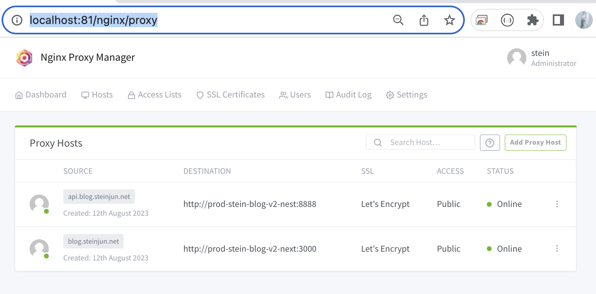
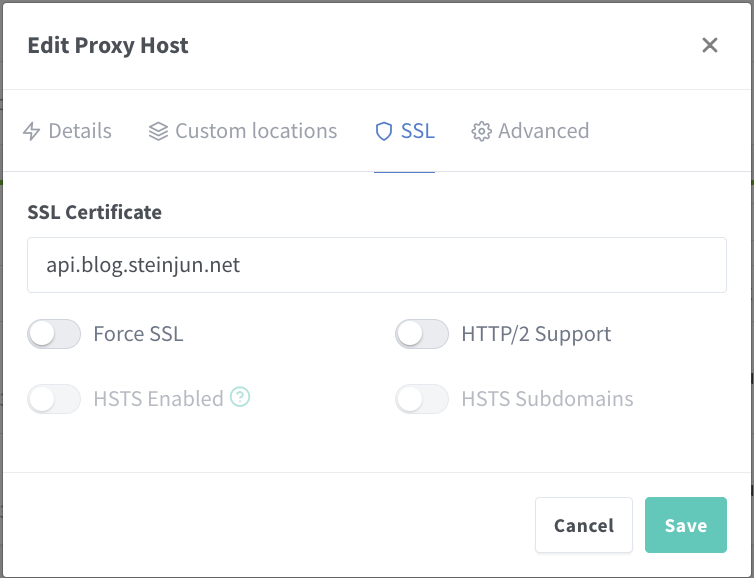

# nginx-proxy-manger
https://nginxproxymanager.com/
1. 기존에 사용하던 docker-compose로 nginx-proxy + let's encrypt 조합으로는 하나의 docker compose 밖에 서비스하지 못함
2. 따라서 proxy+ssl 기능과 서비스를 분리시킬 필요가 있엇음.
3. 이를 nginx-proxy-manager를 통해서 해결

GUI 형태로 proxy를 모두 관리할 수 있음

# 설정

1. Domain Names: 사용자가 진입할 도메인을 입력한다. 여러개를 입력할 수도 있다. 자신이 사용하고 있는 domain을 작성해야한다(구매필요)
2. Scheme: nginx-proxy-manager와 실제 서비스와 통신할때 사용하는 scheme을 선택한다. 여기선 docker network 내부에서 통신하므로 http로 설정한다.
3. Forward Hostname / IP: 포워딩할 주소를 입력한다. 여기선 prod-stein-blog-v2-nest이다. 이런 이름을 host로 사용할 수 있는 것은 동일한 docker network로 연결해줬기 때문이다.(docker network는 아래 설명)
4. Forward Port: 서비스가 열어놓은(사용하는) port를 입력한다.

5. 처음에 none으로 되어있는데, 사용함으로 변경하면 된다.(지금은 이미 인증서를 발급받은 화면)

# Docker Network 사용
https://nginxproxymanager.com/advanced-config/#best-practice-use-a-docker-network  
docker network를 동일하게 묶으면 container name을 host로 http 통신할 수 있다.

https://captcha.tistory.com/70  

docker network ls, docker network inspect로 network의 자세한 내용을 확인할 수 있다.