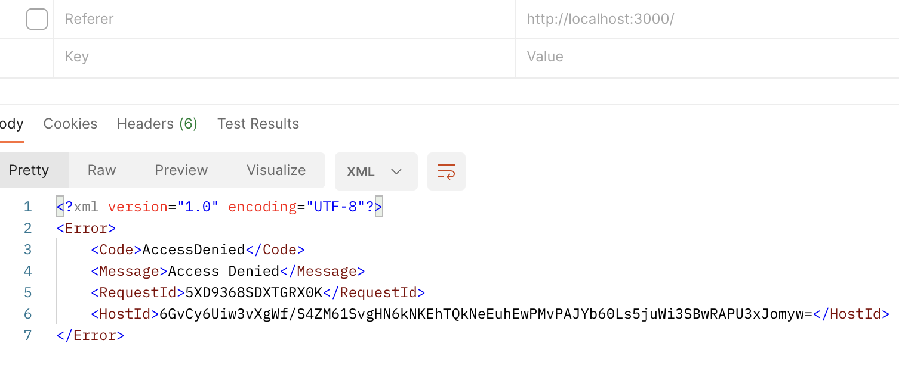
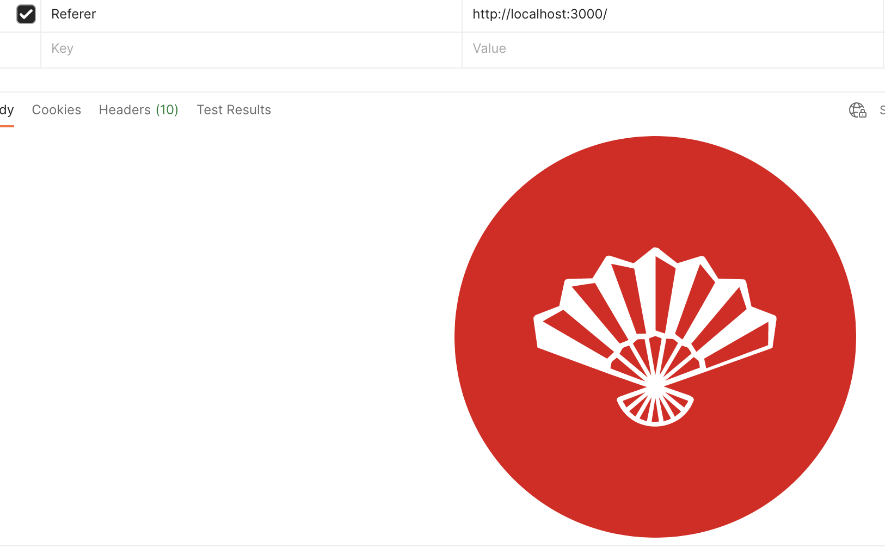

referer를 확인해서 s3자원을 함부러 가져가지 못하게 하려면 아래와 같이 버킷 정책을 설정하면된다. 단, 악의적 사용자가 Referer를 입력해서 전달한다면 막을 수 없다.
```json
{
    "Version": "2012-10-17",
    "Id": "Policy1691036112073",
    "Statement": [
        {
            "Sid": "Stmt1691036110423",
            "Effect": "Allow",
            "Principal": "*",
            "Action": "s3:GetObject",
            "Resource": "arn:aws:s3:::dapada-app/*",
            "Condition": {
                "StringLike": {
                    "aws:Referer": [
                        "http://localhost:3000/*",
                        "사용할 사이트 주소"
                    ]
                }
            }
        }
    ]
}
```

막아낸 모습


이렇게 postman에서 뚫을 수 있다.
